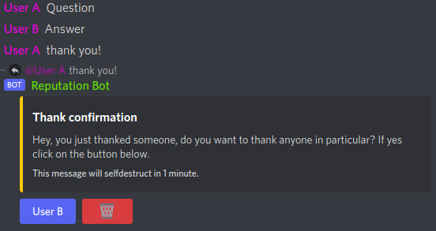
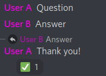
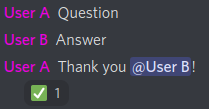
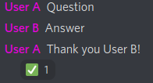

# Giving reputation

The bot offers several methods to give reputation to users. Every reputation is bound to a message. It is not
possible to give reputation without attaching it to a message. Deleting the message or emote which gave reputation to a
user results in removal of the given reputation.

Active ways to give reputation can be configured with the `repsettings` command.

## Requirements

### Chat activity

The bot implements some mechanics to detect which users are probably eligible to receive reputation.

```yaml
User A: Some Message  # (1)
User B: Question?  # (2)
User C: Answer # (3)
User B: Thank you # (4)
```

1. User A can't receive reputation because he has no message after the question
2. This is the inital question. This adds User B to the donor context, which contains users eligible to give reputation
3. A possible answer for the question. This adds User C to the receiver context, which contains users eligible to 
   receive reputation
4. The message which will trigger the reputation embed

In this conversation user A will not be eligible since there is no chance that A could have helped B before asking the
actual question.

### Voice activity

One other way is to share a voice channel with a user. You can give or receive reputation from and to every user which
shares or shared recently (Duration depends on server settings. Default 30 minutes) a voice channel with you. This
can be done in every channel where reputation is enabled.

## Embed

The embed method is the most common method. If the bot detects a thankword but cant determine a receiver with 100%
confidence a message will be send containing an embed. This embed contains all users which are eligible to receive
reputation from the user which received a thankword.



## Reaction

As an alternative user can also use a custom emote to thank a user.


## Answer

Another method is to answer on the message with a thank phrase.



## Mention

You can also mention the user instead.



Which version you want to allow can be defined in the settings.

## Fuzzy

Instead of mentioning this can be done with some kind of fuzzy matching. The bot will only give reputation with a 
reasonable confidence. Most of the time this will trigger an embed instead.


